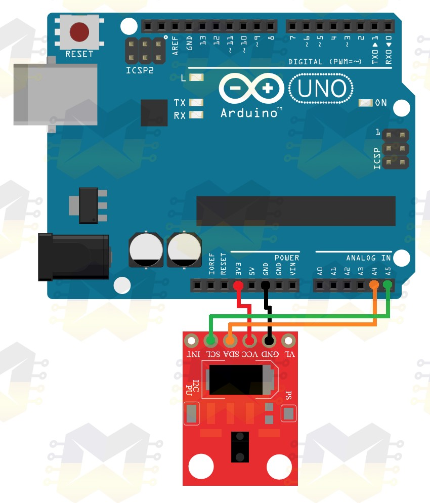

# screen-position-gesture-control

[](https://www.python.org/)
[](https://www.arduino.cc/)

Projeto que permite um usuário posicionar janelas no Linux a partir de gestos com a mão.

Absolutamente desnecessário, porém muito legal.

## Materiais

- Arduino
- Sensor de gestos APDS-9960

## Esquema de ligação



## Como utilizar

- Carregue o código `arduino\arduino.ino` para seu Arduino

- Instale as dependências do projeto utilizando o [Poetry](https://python-poetry.org/)

```sh
poetry install
```

- Conecte seu Arduino ao PC utilizando alguma porta USB

- É necessário dar permissão de leitura e escrita à porta serial antes de rodar o script `main.py` na máquina:

```sh
sudo chmod a+rw /dev/ttyACM0
```

- Execute o script `main.py`

```
poetry run python main.py
```

- Faça gestos na frente do sensor para utilizar. Os seguintes gestos são transformados nos seguintes atalhos de teclado:

| Gesto | Atalho |
|----------|-------------|
| Mover a mão para a esquerda | winkey + → |
| Mover a mão para a direita | winkey + ← |
| Mover a mão para a cima | winkey + ↑ |
| Mover a mão para a baixo | winkey + ↓ |

## Referências

- https://blogmasterwalkershop.com.br/arduino/como-usar-com-arduino-sensor-de-gestos-e-de-cor-apds-9960
- https://pyserial.readthedocs.io/en/latest/
- https://github.com/boppreh/keyboard
